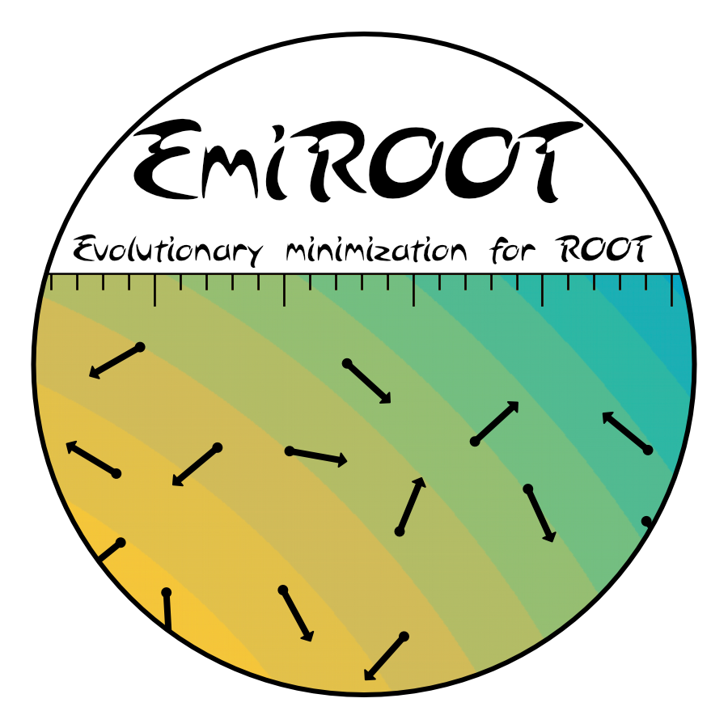

# EmiR: Evolutionary minimizer for ROOT 

Classical minimization methods, like *gradient descent* or *quasi-Newton techniques*,have been proved to struggle in dealing with optimization problems with a high-dimensional search space or subject to complex nonlinear constraints. In last decade, the interest on metaheuristic nature inspired algorithms has been growing steadily, due to their flexibility and effectiveness. EmiR is a package for R which implements several methauristic algorithms for optimization problems:

* *Artificial Bee Colony Algorithm*;
* *Bat Algorithm*;
* *Cuckoo Search*;
* *Genetic Algorithm*;
* *Gravitationl Search Algorithm*;
* *Grey Wolf Optimization*;
* *Harmony Search*;
* *Improved Harmony Search*;
* *Moth-flame Optimization*;
* *Particle Swarm Optimization*;
* *Simulated Annealing*;
* *Whale Optimization Algorithm*. 

Unlike other available tools, EmiR can be used not only for unconstrained problems, but also for problems subjected to inequality constraints and for integer or mixed-integer problems. 

## Example of usage

```
miele_cantrell <- function(x) {
  x1 <- x[1]
  x2 <- x[2]
  x3 <- x[3]
  x4 <- x[4]
  value <- (exp(-x1) - x2)^4 + 100*(x2 - x3)^6 + (tan(x3 - x4))^4 + x1^8
  return(value)
}

p1 <- parameter("x1", -2, 2, FALSE)
p2 <- parameter("x2", -2, 2, FALSE)
p3 <- parameter("x3", -2, 2, FALSE)
p4 <- parameter("x4", -2, 2, FALSE)

conf_algo <- config_bat(iterations = 200, population_size = 100)
results <- minimize(algorithm_id = "BAT", 
                    obj_func = miele_cantrell, 
                    parameters = list(p1, p2, p3, p4),
                    config = conf_algo)
print(results)
```
